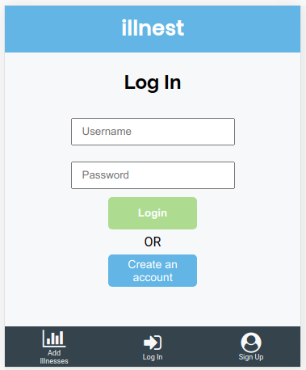
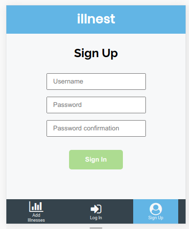
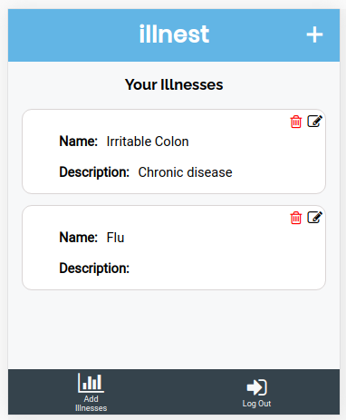
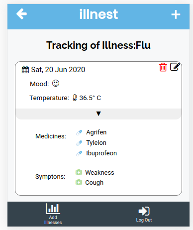
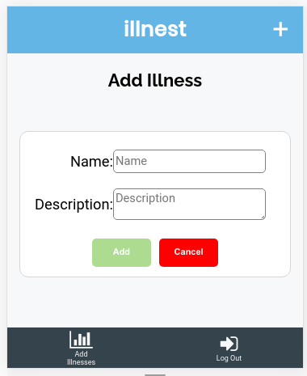
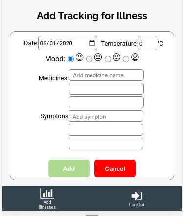

## Final Capstone Project Project: Tracking app

  <h1 color= "rgb(243, 190, 44)" font-size= "40"> illnest </h1>

## Table of Contents

* [About the Project](#about-the-project)
* [Illnest](#illnest)
  * [Installation](#installation)
* [Technologies used](#technologies-used)
* [Author](#author)
* [Show your Support](#show-your-support)
* [Acknowledgments](#acknowledgments)

<!-- ABOUT THE PROJECT -->
## About The Project

The objective of this project was to create a tracking App in which a user is presented with a list of things to be measured. For the Front End, I used React and Ruby on Rails for the Back-End API.

Live version of the project: [Live version](https://illnest.netlify.app/)

Live version of the API: [illnest-API](https://illnest-api.herokuapp.com/)

Project Link: [Final-capstone](https://github.com/mcastorena0316/final-capstone)

Project Link API: [Final-capstone-API](https://github.com/mcastorena0316/finalproject-api)

<!-- THE APP -->
## illnest

On illnest, you can track a specific illness you have, whether is chronic or is a recent affliction, it can be measure here. 

On the Login page, you write your username and password. If you are not registered, you can go to Signup and fill the form with your data. 

Then on the main page, you have all the illnesses/afflictions you want to monitor. 

If you click on a specific one, you are redirected to all the trackings you have registered previously. Some of the data included in this section are:
- Date of the Tracking
- The mood of the date
- Temperature
- Medicines
- Symptoms

You can always edit/delete/add new illnesses and trackings with the corresponding forms: 

<!-- INSTALLATION -->
### Installation

You can always use the [live version](https://illnest.netlify.app/) or install it locally using these steps:

#### Clone my repository

`$ git clone https://github.com/mcastorena0316/final-capstone`

#### Go to my project's folder

`$ cd final-capstone`

#### Get the dependencies needed

`$ npm install`

#### Open the project
`$ npm run start`

<!-- TECHNOLOGIES USED -->
## Technologies used

* React
* Redux
* Javascript
* Eslint
* Netlify

<!--AUTHOR -->
## Author
<table style="width:100%">
  <tr>
    <td>
      

        
        <h2>
          <a href="https://mcastorena0316.github.io/portfolio/" target="_blank" rel="author">
              Melissa Castorena
          </a>
        </h2>
      

    </td>
    <td>
      

       <a href="mcastorena0316@gmail.com" target="_blank" rel="author">
          
          <h3>
              Email me to 
              <a href="mailto:mcastorena0316@gmail.com">
                  mcastorena0316@gmail.com
              </a>
          </h3>
        </a>
        <a href="https://www.linkedin.com/in/melissa-castorena/">
          
          <h3>
              Connect to my Linkedin
          </h3>
        </a>
      

    </td>
  </tr>
</table>

<!-- SHOW YOUR SUPPORT -->
## Show your Support

Give a star if you like this project!

<!-- ACKNOWLEDGEMENTS -->
## Acknowledgments

* [Microverse](https://www.microverse.org/)
